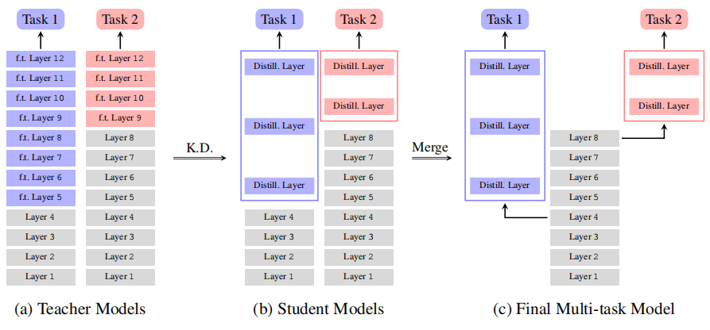

# CentraBert

CentraBert is an out-of-the-box framework for solving NLU tasks based on BERT.


## Installation

It's recommended to install all the packages you need in an virtual environment
```bash
conda create -n centra-bert --file requirements.txt python=3.6
conda activate centra-bert
```

## Get started

There are 3 steps to get a multi-task model with CentraBert:
1. Fine tuning
2. Distill (Optional)
3. Merge



### Preparation

Here is an example of fine tuning on the GLUE data set MRPC and RTE.

Before running this example, be sure you have downloaded GLUE data and converted its format.

```bash
python convert_data_format.py --task=rte --input_dir=data/glue --output_dir=data/glue
```

You have to create a task config file like `conf/glue_task_config.cfg`
```bash
[mrpc_conf]
task_domain = mrpc
task_type = classification
input_file = data/glue/mrpc/train_json_format.txt,data/glue/mrpc/dev_json_format.txt,data/glue/mrpc/test_json_format.txt
max_seq_length = 128
output_method = cls
is_eng = True
```

### Fine tuning

Different tasks may have different optimal fine-tuning layers, so you can use the following script `shell/fine_tuning.sh` to select the best fine-tuning layers.
```bash
#!/usr/bin/env bash

# General param
bert_config_file=conf/uncased_bert_base/bert_config.json
vocab_file=conf/uncased_bert_base/vocab.txt
output_dir=model/glue/teacher
init_checkpoint=model/uncased_bert_base/bert_model.ckpt
task_config=conf/glue_task_config.cfg
num_train_epoch=10
train_batch_size=64
gpu_id=2

# Current task
task=rte

# Hyper param, separated by commas
learning_rate=2e-5,1e-4
fine_tuning_layers=6,8

# Number of repetitions for each hyper parameter
exam_num=3

for lr in ${learning_rate//,/ }
do
    for layers in ${fine_tuning_layers//,/ }
    do
        for i in $(seq 1 ${exam_num})
        do
            python fine_tuning.py \
                --bert_config_file=${bert_config_file} \
                --vocab_file=${vocab_file} \
                --output_dir=${output_dir} \
                --init_checkpoint=${init_checkpoint} \
                --task_config=${task_config} \
                --available_tasks=${task} \
                --current_task=${task} \
                --ex_idx=${i} \
                --num_train_epoch=${num_train_epoch} \
                --train_batch_size=${train_batch_size} \
                --learning_rate=${lr} \
                --fine_tuning_layers=${layers} \
                --gpu_id=${gpu_id}
        done
    done
done

# Result summary
python result_summary.py \
    --output_dir=${output_dir} \
    --task=${task} \
    --learning_rate=${learning_rate} \
    --fine_tuning_layers=${fine_tuning_layers} \
    --exam_num=${exam_num} \
    --dev=True \
    --version=teacher
```
As you can see, this script will run several training procedures with different hyper-parameter, and the best result will be recorded in `$output_dir/$task/summary.txt`, like:
```bash
Best metrics: 89.77, best checkpoint: model/glue/teacher/mrpc/Lr-2e-05-Layers-8/ex-3/best_checkpoint/1623838640/model.ckpt-570
```

### Distill
After fine tuning, you can use the following script `shell/distill.sh` to distill the teacher model for better performances.
```bash
#!/usr/bin/env bash

# General param
bert_config_file=conf/uncased_bert_base/bert_config.json
vocab_file=conf/uncased_bert_base/vocab.txt
output_dir=model/glue/student
task_config=conf/glue_task_config.cfg
num_train_epoch=10
train_batch_size=64
gpu_id=6

# Teacher info
teacher_fine_tuning_layers=9
best_teacher_checkpoint=model/glue/teacher/rte/Lr-2e-05-Layers-9/ex-3/best_checkpoint/1623902794/model.ckpt-380

# Current task
task=rte

# Hyper param, separated by commas
learning_rate=2e-5
fine_tuning_layers=1,2

# Number of repetitions for each hyper parameter
exam_num=3

for lr in ${learning_rate//,/ }
do
    for layers in ${fine_tuning_layers//,/ }
    do
        for i in $(seq 1 ${exam_num})
        do
            python distill.py \
                --bert_config_file=${bert_config_file} \
                --vocab_file=${vocab_file} \
                --output_dir=${output_dir} \
                --best_teacher_checkpoint=${best_teacher_checkpoint} \
                --teacher_fine_tuning_layers=${teacher_fine_tuning_layers} \
                --task_config=${task_config} \
                --available_tasks=${task} \
                --current_task=${task} \
                --ex_idx=${i} \
                --num_train_epoch=${num_train_epoch} \
                --train_batch_size=${train_batch_size} \
                --learning_rate=${lr} \
                --student_fine_tuning_layers=${layers} \
                --gpu_id=${gpu_id}
        done
    done
done

# Result summary
python result_summary.py \
    --output_dir=${output_dir} \
    --task=${task} \
    --learning_rate=${learning_rate} \
    --fine_tuning_layers=${fine_tuning_layers} \
    --exam_num=${exam_num} \
    --dev=True \
    --keep_layers=$((12-teacher_fine_tuning_layers)) \
    --version=student
```
This process is basically the same as the above fine tuning. The only difference is that you need to specify the teacher model which is going to be distilled.

### Merge
Now, you can merge all task's branches into one model. Firstly, you have to create a branch config file like `conf/gather_branch.cfg` telling model to load which checkpoint
```bash
[ckpt_conf]
mrpc = model/glue/student/mrpc/Lr-2e-05-Layers-4-2/ex-2/best_checkpoint/1623900741/model.ckpt-572
rte = model/glue/student/rte/Lr-2e-05-Layers-3-2/ex-3/best_checkpoint/1623910751/model.ckpt-382

[layer_conf]
mrpc = 5,6
rte = 4,5
```
Then you can use the following script `shell/merge.sh` to merge all branches.
```bash
#!/usr/bin/env bash

# General param
bert_config_file=conf/uncased_bert_base/bert_config.json
vocab_file=conf/uncased_bert_base/vocab.txt
output_dir=model/glue/gather
init_checkpoint=model/uncased_bert_base/bert_model.ckpt
task_config=conf/glue_task_config.cfg
branch_config=conf/branch.cfg
gather_from_student=True
gpu_id=3
input_file=data/glue/tmp_input_file.txt

# Current tasks
available_tasks=mrpc,rte

python merge_branch.py \
    --bert_config_file=${bert_config_file} \
    --vocab_file=${vocab_file} \
    --output_dir=${output_dir} \
    --init_checkpoint=${init_checkpoint} \
    --task_config=${task_config} \
    --branch_config=${branch_config} \
    --available_tasks=${available_tasks} \
    --gather_from_student=${gather_from_student} \
    --gpu_id=${gpu_id} \
    --input_file=${input_file}
```
The checkpoint in the latest task directory contains trained parameter for all tasks.