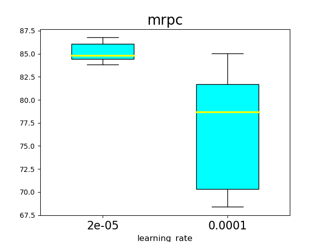
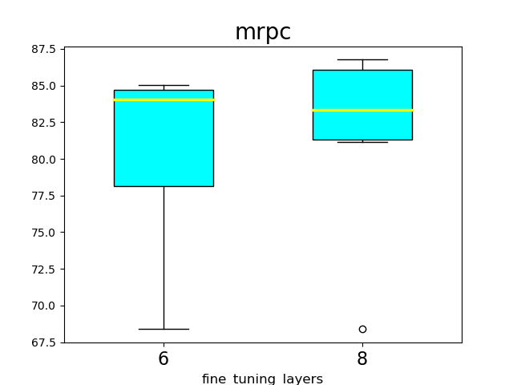

# CentraBert

We present an efficient BERT-based multi-task (MT) framework that is particularly suitable for iterative and incremental development of the tasks. 
The proposed framework is based on the idea of partial fine-tuning, i.e. only fine-tune some top layers of BERT while keep the other layers frozen. 

Unlike in conventional Multi-Task Learning where the tasks are coupled due to joint training, 
in the proposed framework the tasks are independent of each other and can be updated on a regular basis.
One key advantage our framework provides is that the owner of one task do not need to coordinate with other task owners in order to update the model for that task, 
and any modification made to that task does not interfere with the other tasks.

## Installation

We recommend to install all relevant packages in a virtual environment
```bash
conda create -n centra-bert --file requirements.txt python=3.6
conda activate centra-bert
```

## Get Started

The proposed framework features a pipeline that consists of three steps: 
1. Single-task partial fine-tuning
2. Single-task knowledge-distillation
3. Model merging


In what follows, we demonstrate the functionality that this library offers on two GLUE tasks MRPC and RTE as an example.

### Preparation
Before proceeding, we need to download the task corpora and converted their format. 
This can be achieved via the following script:

```bash
python convert_data_format.py --task=rte --input_dir=data/glue --output_dir=data/glue
python convert_data_format.py --task=mrpc --input_dir=data/glue --output_dir=data/glue
```

Next, we need to create a task config file `conf/glue_task_config.cfg` to specify meta information of the task including
name of the task, type of the task, corpus path, etc.
```bash
[rte_conf]
task_name = rte
task_type = classification
input_file = data/glue/rte/train_json_format.txt,data/glue/rte/dev_json_format.txt,data/glue/rte/test_json_format.txt
max_seq_length = 128
output_method = cls
is_eng = True

[mrpc_conf]
task_name = mrpc
task_type = classification
input_file = data/glue/mrpc/train_json_format.txt,data/glue/mrpc/dev_json_format.txt,data/glue/mrpc/test_json_format.txt
max_seq_length = 128
output_method = cls
is_eng = True
```

### Single-task partial fine-tuning
In the first step, we partial fine-tune for each task an independent copy of BERT. 
The exact number of layers `L` to fine-tune may vary across the tasks. 
We propose to experiment for each task with different value of `L` and select the best one according to some predefined criterion. 

The following code snippet (see also `shell/fine_tuning.sh`) trains a number of models for the task of RTE with different hyper-parameters.

```bash
#!/usr/bin/env bash

# General param
bert_config_file=conf/uncased_bert_base/bert_config.json
vocab_file=conf/uncased_bert_base/vocab.txt
output_dir=model/glue/teacher
init_checkpoint=model/uncased_bert_base/bert_model.ckpt
task_config=conf/glue_task_config.cfg
num_train_epoch=10
train_batch_size=64
gpu_id=2

# Current task
task=rte

# Hyper param, separated by commas
learning_rate=2e-5,5e-5
fine_tuning_layers=4,5,6,7,8,9,10

# Number of repetitions for each hyper parameter
exam_num=3

for lr in ${learning_rate//,/ }
do
    for layers in ${fine_tuning_layers//,/ }
    do
        for i in $(seq 1 ${exam_num})
        do
            python fine_tuning.py \
                --bert_config_file=${bert_config_file} \
                --vocab_file=${vocab_file} \
                --output_dir=${output_dir} \
                --init_checkpoint=${init_checkpoint} \
                --task_config=${task_config} \
                --available_tasks=${task} \
                --current_task=${task} \
                --ex_idx=${i} \
                --num_train_epoch=${num_train_epoch} \
                --train_batch_size=${train_batch_size} \
                --learning_rate=${lr} \
                --fine_tuning_layers=${layers} \
                --gpu_id=${gpu_id}
        done
    done
done

# Result summary
python result_summary.py \
    --output_dir=${output_dir} \
    --task=${task} \
    --learning_rate=${learning_rate} \
    --fine_tuning_layers=${fine_tuning_layers} \
    --exam_num=${exam_num} \
    --dev=True \
    --version=teacher
```
When the training is completed, we can find in the log file `model/glue/teacher/rte/summary.txt` the information on model with the best dev result:
```bash
Best metrics: 89.77, best checkpoint: model/glue/teacher/mrpc/Lr-2e-05-Layers-8/ex-3/best_checkpoint/1623838640/model.ckpt-570
```
This is the model that will be used as the teacher in the subsequent knowledge distillation step.

### Single-Task Knowledge Distillation
In this step, 
we compress the `L` fine-tuned layers in the teacher model into a smaller `l` layered module. 
The following code snippet (see also `shell/distill.sh`) trains three student models for each `l` in `{1, 2, 3}`.
The training process is basically the same as in the previous step. The only difference is that we need to specify the teacher model that is going to be distilled.

```bash
#!/usr/bin/env bash

# General param
bert_config_file=conf/uncased_bert_base/bert_config.json
vocab_file=conf/uncased_bert_base/vocab.txt
output_dir=model/glue/student
task_config=conf/glue_task_config.cfg
num_train_epoch=10
train_batch_size=64
gpu_id=6

# Teacher info
teacher_fine_tuning_layers=9
best_teacher_checkpoint=model/glue/teacher/rte/Lr-2e-05-Layers-9/ex-3/best_checkpoint/1623902794/model.ckpt-380

# Current task
task=rte

# Hyper param, separated by commas
learning_rate=2e-5
fine_tuning_layers=1,2,3

# Number of repetitions for each hyper parameter
exam_num=3

for lr in ${learning_rate//,/ }
do
    for layers in ${fine_tuning_layers//,/ }
    do
        for i in $(seq 1 ${exam_num})
        do
            python distill.py \
                --bert_config_file=${bert_config_file} \
                --vocab_file=${vocab_file} \
                --output_dir=${output_dir} \
                --best_teacher_checkpoint=${best_teacher_checkpoint} \
                --teacher_fine_tuning_layers=${teacher_fine_tuning_layers} \
                --task_config=${task_config} \
                --available_tasks=${task} \
                --current_task=${task} \
                --ex_idx=${i} \
                --num_train_epoch=${num_train_epoch} \
                --train_batch_size=${train_batch_size} \
                --learning_rate=${lr} \
                --student_fine_tuning_layers=${layers} \
                --gpu_id=${gpu_id}
        done
    done
done

# Result summary
python result_summary.py \
    --output_dir=${output_dir} \
    --task=${task} \
    --learning_rate=${learning_rate} \
    --fine_tuning_layers=${fine_tuning_layers} \
    --exam_num=${exam_num} \
    --dev=True \
    --keep_layers=$((12-teacher_fine_tuning_layers)) \
    --version=student
```

### Model Merging
In the final step,  we merge the single task models into one multi-task model. 
To do this, we need to specify in the config file `conf/gather_branch.cfg` which checkpoint to load for each of the tasks
```bash
[ckpt_conf]
mrpc = model/glue/student/mrpc/Lr-2e-05-Layers-4-2/ex-2/best_checkpoint/1623900741/model.ckpt-572
rte = model/glue/student/rte/Lr-2e-05-Layers-3-2/ex-3/best_checkpoint/1623910751/model.ckpt-382

[layer_conf]
mrpc = 5,6
rte = 4,5
```
Then by executing the script `shell/merge.sh` to merge all branches.
```bash
#!/usr/bin/env bash

# General param
bert_config_file=conf/uncased_bert_base/bert_config.json
vocab_file=conf/uncased_bert_base/vocab.txt
output_dir=model/glue/gather
init_checkpoint=model/uncased_bert_base/bert_model.ckpt
task_config=conf/glue_task_config.cfg
branch_config=conf/branch.cfg
gather_from_student=True
gpu_id=3
input_file=data/glue/tmp_input_file.txt

# Current tasks
available_tasks=mrpc,rte

python merge_branch.py \
    --bert_config_file=${bert_config_file} \
    --vocab_file=${vocab_file} \
    --output_dir=${output_dir} \
    --init_checkpoint=${init_checkpoint} \
    --task_config=${task_config} \
    --branch_config=${branch_config} \
    --available_tasks=${available_tasks} \
    --gather_from_student=${gather_from_student} \
    --gpu_id=${gpu_id} \
    --input_file=${input_file}
```
The checkpoint in the latest task directory contains trained parameter for all tasks.

## Advanced

### Update Model
#### Delete a task branch from a merged model.

Assume that we have a merged multi-task model containing mrpc, rte, mnli and qnli as task branches. To remove a branch, e.g. rte, we run the following script:
```bash
#!/usr/bin/env bash

# General param
bert_config_file=conf/uncased_bert_base/bert_config.json
vocab_file=conf/uncased_bert_base/vocab.txt
output_dir=model/glue/gather
init_checkpoint=somewhere/merged_model/model.ckpt
task_config=conf/glue_task_config.cfg
branch_config=conf/branch.cfg
gather_from_student=True
gpu_id=3
input_file=data/glue/tmp_input_file.txt

# The original task list contains four tasks, now remains three.
# available_tasks=mrpc,rte,mnli,qnli
available_tasks=mrpc,mnli,qnli

python update.py \
    --bert_config_file=${bert_config_file} \
    --vocab_file=${vocab_file} \
    --output_dir=${output_dir} \
    --init_checkpoint=${init_checkpoint} \
    --task_config=${task_config} \
    --branch_config=${branch_config} \
    --available_tasks=${available_tasks} \
    --gather_from_student=${gather_from_student} \
    --gpu_id=${gpu_id} \
    --input_file=${input_file}
``` 

#### Add a new task branch into a merged model.

To add a new task (e.g. mnli) to an existing merged multi-task mode, run the following script:
```bash
#!/usr/bin/env bash

# General param
bert_config_file=conf/uncased_bert_base/bert_config.json
vocab_file=conf/uncased_bert_base/vocab.txt
output_dir=model/glue/gather
init_checkpoint=somewhere/merged_model/model.ckpt
task_config=conf/glue_task_config.cfg
branch_config=conf/branch.cfg # A new branch config which contains mnli's fine tuning layers
gather_from_student=True
gpu_id=3
input_file=data/glue/tmp_input_file.txt

# Current tasks, add the new task mnli
available_tasks=mrpc,rte,mnli

# new task info
update_checkpoint=somewhere/mnli/model.ckpt
update_scope=mnli


python update.py \
    --bert_config_file=${bert_config_file} \
    --vocab_file=${vocab_file} \
    --output_dir=${output_dir} \
    --init_checkpoint=${init_checkpoint} \
    --update_checkpoint=${update_checkpoint} \
    --update_scope=${update_scope} \
    --task_config=${task_config} \
    --branch_config=${branch_config} \
    --available_tasks=${available_tasks} \
    --gather_from_student=${gather_from_student} \
    --gpu_id=${gpu_id} \
    --input_file=${input_file}
```

#### Update an exist task in a merged model.

For example, you have a merged model which contains mrpc, rte. You can use the following scripts to update an exist task branch in this model, such as rte:
```bash
#!/usr/bin/env bash

# General param
bert_config_file=conf/uncased_bert_base/bert_config.json
vocab_file=conf/uncased_bert_base/vocab.txt
output_dir=model/glue/gather
init_checkpoint=somewhere/merged_model/model.ckpt
task_config=conf/glue_task_config.cfg
branch_config=conf/branch.cfg # A new branch config if you change rte's fine tuning layers
gather_from_student=True
gpu_id=3
input_file=data/glue/tmp_input_file.txt

# Current tasks
available_tasks=mrpc,rte

# new task info
update_checkpoint=somewhere/new-rte/model.ckpt
update_scope=rte


python update.py \
    --bert_config_file=${bert_config_file} \
    --vocab_file=${vocab_file} \
    --output_dir=${output_dir} \
    --init_checkpoint=${init_checkpoint} \
    --update_checkpoint=${update_checkpoint} \
    --update_scope=${update_scope} \
    --task_config=${task_config} \
    --branch_config=${branch_config} \
    --available_tasks=${available_tasks} \
    --gather_from_student=${gather_from_student} \
    --gpu_id=${gpu_id} \
    --input_file=${input_file}
```

#### How does it work?
The merged model is generated as follows:
1. Build the graph that contains a frozen part and several fine-tuned parts according to the `layer_conf` in `branch_config` 
2. Load parameters from `init_checkpoint` to initialize the original model
3. Load parameters with specific scope `update_scope` from `update_checkpoint` to initialize the new task branch or reinitialize the exist task branch.

### Result Analysis
You can use the following scripts to analysis model performance among several training procedures.
```bash
output_dir=model/glue/teacher
task=mrpc
learning_rate=2e-5,1e-4
fine_tuning_layers=6,8
exam_num=3

# key_param=fine_tuning_layers
key_param=learning_rate

python result_summary.py \
    --job=plot \
    --key_param=${key_param} \
    --output_dir=${output_dir} \
    --task=${task} \
    --learning_rate=${learning_rate} \
    --fine_tuning_layers=${fine_tuning_layers} \
    --exam_num=${exam_num} \
    --dev=True \
    --version=teacher
```


